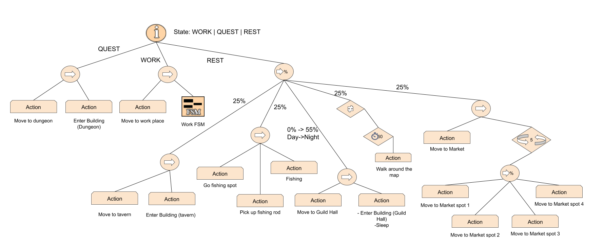
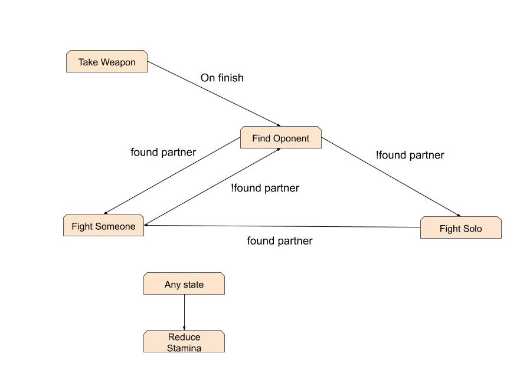
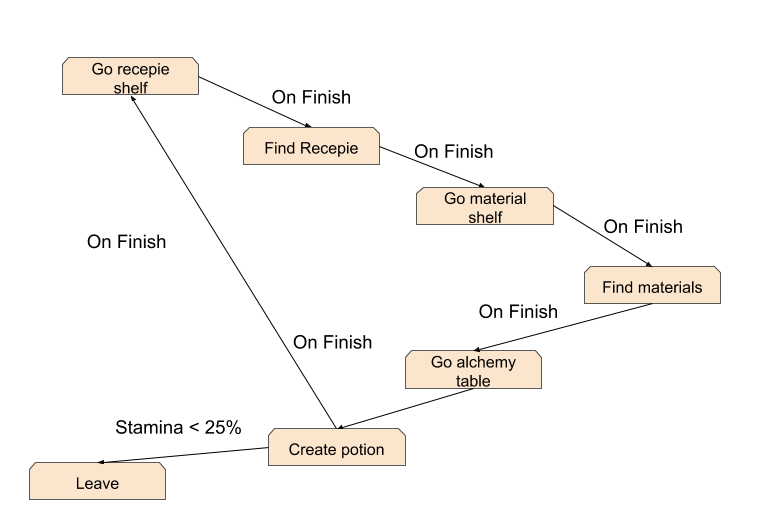
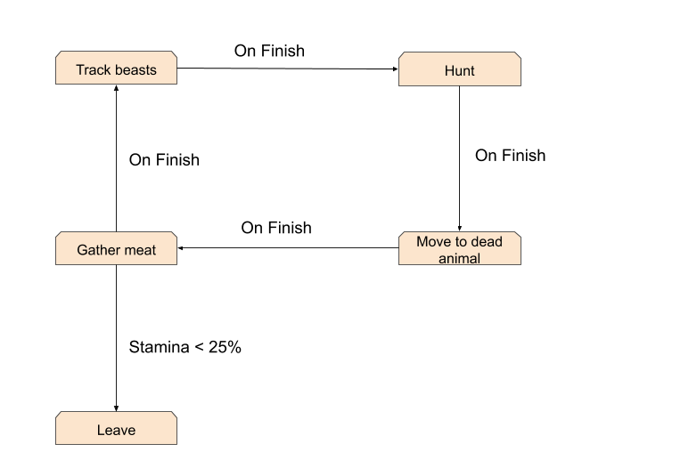
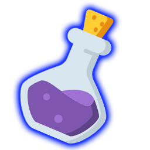
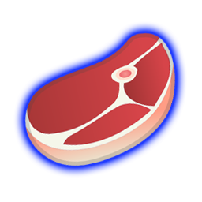
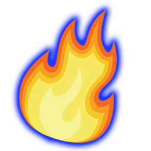
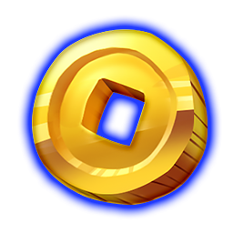
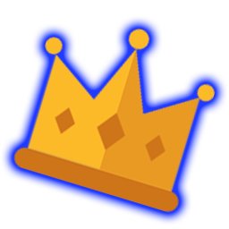

# Guild Master

Guild Master is a fantasy game where the player takes control of a collective of heroes who are part of a brotherhood. The player needs to recruit members for the guild, whom will be able to produce different type of resources. These resources will be used as provisions to send the members to the Dungeon, on different kind of quests, to increase their success chance.
These Dungeon quests will reward the player with special resources used to upgrade the guild buildings like the hall or blacksmith, allowing access to more members and improvements for them. 

The end goal is to defeat the Final Quest at day 5 or else the game will end in Defeat.

## Authors

### Marc Guillén

https://github.com/Marcgs96

## Axel Alavedra

https://github.com/AxelAlavedra

## AI Archetypes

Every agent follows this Behaviour tree, When resting and when they are in quest they do the same, but every agent has it's own FSM when working nested in their Behaviour tree.

When resting, the agents recover stamina.

While daylight agents have a 25% of going to 4 different places:

* The market: agent walks around the market and visits 4 diferent spots randomly.
* Fishing: agent walks to the fishing spot, picks a fishing pole and starts fishing.
* The tavern: agent walks to the tavern and enters.
* Walk: agent goes for a walk and visit random spots in the map while chilling.

While night agent has a 55% chance of going to sleep and rest % is divided between the rest of the options above.

When in quest, the agent moves to the dungeon and enters in it, when the quest is complete they apear again.

[View original](https://github.com/Marcgs96/AI_Game/blob/master/Wiki/Behaviour/General_behaviour_tree.png)

* ### Knight

While working knights go to the warrior training area, pick up a weapon and try to find a couple, if they have no couple to fight with they fight solo.

* ### Mage

Mages go to the Alchemy tower while working, they create potions by going to a recipe shelf and selecting a recipe, then they go to a material shelf and pickup the materials needed, at last they go to the alchemy table and craft the potion and repeat.

* ### Hunter

Hunters while working they gather meat, to do it, they go to the forest and wander for a prey, after they spot one, they kill it and moves towards it, then gather the meat and go again.

## Resources

* ### Potion

Potions are a resource the player can assign to a quest, allowing a member to heal 50% stamina when its stamina drops below 25%. Obtainable via mage work.

* ### Meat

Meats are a resource the player can assign to a quest, during the quest, a food check can happen, each member needs to eat 1 piece of meat, if there is no food left, stamina will decrease a 25% to each member who cant eat. Obtainable via hunter work.

* ### Flame

Flames are a resource the player can assign to the quests to increase the rewards gained on succes. Obtainable via warrior work.

* ### Gold

Gold is a resource required to upgrade buildings such as the Guild House and the Blacksmith. It can also be used to buy upgrades for the heroes equipment. Obtainable via quests.

* ### Shield

Shields are a resource required to upgrade the Blacksmith. Obtainable via quests.

* ### Crown

Crowns are a resource required to upgrade the Guildhall. Obtainable via quests.

## Player Interactions
 
The player is able to:

 * Recruit heroes to expand the guild.

 * Select a quest from the quest board, assign members and provisions to it and then send the group to the dungeon.
 
 * Upgrade the guild house and the blacksmith building using the resources gathered doing quests.
 
 * Make a member work or rest with the click of a button.

## Quests
Quests are randomly generated every new day and have different resources as rewards depending on the difficulty and size of it.
There's one, three, five and ten men quests, also a Quest can be an Adventure or a Bounty. Bounties favor Flame resource as provision, Adventures favor meat.

Each quest has enemies assigned to them, which the group will require to counter to improve their chances of finishing the quest. Each member class counters a different enemy.
Warriors counter skeletons.
Mages counter orcs.
Hunters counter bandits.

At the end of a quest, each member with 0 stamina has a great chance of dying and be removed from the game completely.

## Controls
- W, A, S, D : Camera movement
- Mouse wheel : Camera zoom
- Spacebar: Pause
- Click on a member from list : Focus camera on it
